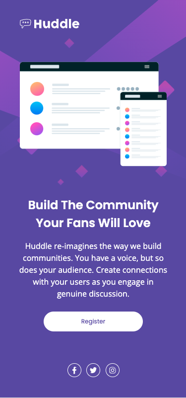

# Francis Wafula - Huddle Landing Page with Intro Section

This the [Huddle Landing Page Hero](design/desktop-preview.png). Thanks for checking it out

## Table of contents 🧳

- [Overview](#overview)
  - [The objective](#the-objective)
  - [Screenshot](#screenshot)
  - [Links](#links)
- [My process](#my-process)
  - [Built with](#built-with)
  - [What I learned](#what-i-learned)
  - [Useful resources](#useful-resources)
- [Author](#author)

## Overview

This is a landing page section for an online service. Also called a hero, it is the 1st thing a potential user sees when they visit your site. During that first visit, the visitor makes a judgement on your site and hence services in less than 5 seconds. That's why landing page designs are critical.

While looking visually appealing, a great landing page should communicate your name, brand, what you do and entice the visitor with a CTA ( call to Action ).

### The objective

To create a landing page that:

- Is visually appealing.
- Communicates the company name to the visitor.
- Conveys branding.
- Explains what you do simply in as few words as possible.
- Entices the visitor with a CTA (call to action).

The colors in this template have been carefully chosen to share the branding. An image to attract the visitors attention. A headline that clearly says what the offer is, a description for additional details and a button for the user to engage further. Do this as a minimum for your landing page projects.

### Screenshot

### Links

- Solution URL: [https://github.com/franco2ke/single-price-grid-component](https://github.com/franco2ke/single-price-grid-component)

## My process

I started by examining the design files. This helped me draw up a rough html structure of the desktop view. In retrospect I should also have drawn up the rough html structure of the mobile view at the same time. This would help me have two different perspectives of the same project.

I found that I required to create a parent container element that would contain the css background images, which also required a gradient.

Next step was to create a 3 row grid container; top row 1 for the Huddle logo, row 2 for the hero image, headline content and call to action button and row 3 for the social media icons. I started by arranging these three sections with a default, block layout but I found the responsive spacing and positioning somewhat complicated afterwhich I opted for CSS Grid.

For the hero image and headline content, flexbox was used. I have found flexbox and CSS grid quite useful for responsive positioning and spacing.

### Built with

- Semantic HTML5 markup
- CSS custom properties
- Flexbox
- CSS Grid
- Desktop first workflow
- [SASS](https://sass-guidelin.es) - Sassy Sass
- [BEM](http://getbem.com/introduction/) - BEM methodology
- node.js, npm, live-server, node-sass, npm-run-all

### What I learned

- Closed media queries.
- Responsive positioning and sizing with CSS Grid ; minmax (min-content, auto).
- BEM naming
- Multiple Background Images

### Useful resources

- [CSS Grid Sizing](https://developer.mozilla.org/en-US/docs/Web/CSS/minmax) - This simple article helped me with the details of posting my solution online. I found it quite simple to post using github pages.

## Author

- Website - [https://www.franciswafula.com](https://www.franciswafula.com)
- Twitter - [@franco2ke](https://twitter.com/franco2ke)

Happy Coding 🎯
